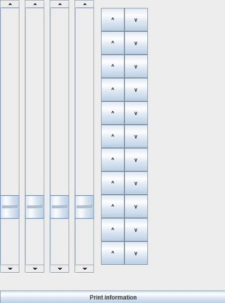

# ElevatorManagementSystem

### Założenia projektu:
- windy są równolegle obok siebie
- na każdym piętrze użytkownik może zamówić windę by pojechać w dół lub w górę (na najniższym/ostatnim piętrze tylko w górę/dół)
- w momencie gdy winda przyjeżdza, użytkownik wybiera piętro docelowe
- system optymalizuje działania zakładając, że użytkownik faktycznie wybierze piętro zgodne z zadeklarowanym kierunkiem
- działa jednak również gdzy użytkownik zamówi windę niezgodnie z prawdą (po prostu mniej optymalnie)
- dla uproszczenia, windy poruszają się ze stałą prędkością tzn. nie hamują, nie rozpędzają się
- przemieszczają się z prędkością jednego piętra na krok symulacji

### Zastosowany język
Do wykonania symulacji wybrałem Javę, ponieważ moim zdaniem dzięki obiektowości idealnie nadaje się do tego typu zadań.
Łatwo w niej również podłączyć interface graficzny do interakcji z symulacją. Do tworzenia intereface'u użyłem biblioteki Swing.
Do prawdziwego zastosowania prawdopodobnie lepiej nadałby się szybszy język np C.

### Środowisko
Projekt został stworzony przy pomocy Gradle, korzystając ze środowiska firmy JetBrains.

### Obsługa
- w funkcji main można ustalić ilość wind jak również zakres pięter (przykładowo: 4 windy i piętra od -2 do 8)
- w interfejsie pionowe suwaki symbolizują windy. Po ich prawej stronie na wysokości każdego piętra znajdują się przyciski do wzywania windy
- na najniższym i ostatnim piętrze odpowiednio przyciski do wezwania windy w dół i w górę są zablokowane
- po naciśnięciu guzika wybrana przez algorytm winda rusza (lub zapamiętuje zlecenie do wykonania, jeśli jest już w ruchu)
- gdy winda dociera na piętro na którym "ktoś wsiada" symulacja zatrzymuje się i czeka na wybór piętra docelowego przez użytkownika (rozwijany panel w prawym gónym rogu)
- naciśnięcie długiego przycisku na dole okna powoduje wypisanie aktualnych informacji o każdej windzie na standardowe wyjście

### Natura algorytmu
- każda z wind ma swoją listę zleceń
- przydzielenie zlecenia odbywa się poprzez znalezienie windy, przy użyciu której użytkownik musiałby (zgodnie z danymi na dany moment) czekać najkrócej
- w windzie zlecenie zostaje przydzielone w pierwszym miejscu na liście w którym jest "po drodze" - nie zmienia kolejności wykonywania poprzednich zleceń
- realizacja w taki sposób to kompromis optymalności z wykonywaniem zleceń w kolejności zgłoszenia, by "docenić" użytkowników którzy czekają dłużej
- gdy winda dojedzie na piętro z którego została zamówiona, użytkownik wybiera piętro i do windy wysyłane jest nowe zlecenie w trybie ORDER - osoba jest w środku i wybrała piętro docelowe
- zlecenia typu ORDER są lekko faworyzowane - przyjąłem, że lepiej gdy użytkownik czeka na zewnątrz niż wewnątrz windy
- (prawdopodonie algorytm można by poprawić rozwijając o system wymiany zleceń między windami po zmianie stanu symulacji)
